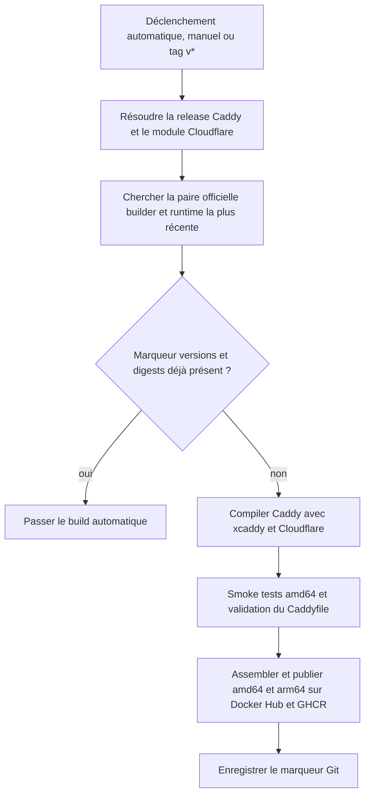

# Guide de maintenance

Ce guide explique comment le workflow construit et publie l'image, quoi vérifier
quand une nouvelle release sort et comment relancer une publication.

## Principe de construction

L'image officielle `caddy` ne contient pas le module DNS Cloudflare. Le binaire
final doit donc être compilé avec les deux composants : le code Caddy amont et
le module `github.com/caddy-dns/cloudflare`.

Le workflow sépare trois versions :

| Valeur | Rôle |
| --- | --- |
| `CADDY_VERSION` | Release Caddy amont à compiler. |
| `CLOUDFLARE_DNS_VERSION` | Version du module Cloudflare à intégrer. |
| `CADDY_BASE_VERSION` (`caddy_base` dans le workflow) | Version des images officielles `builder` et `runtime` servant de bases. |

Exemple : `CADDY_VERSION=2.11.6`, `CLOUDFLARE_DNS_VERSION=v0.2.4` et
`CADDY_BASE_VERSION=2.11.4` signifie que le workflow compile le code Caddy
2.11.6 avec Cloudflare v0.2.4, en utilisant les images officielles Caddy 2.11.4
pour construire et exécuter le résultat. Le runtime officiel fournit les
couches système ; son `/usr/bin/caddy` est remplacé par le binaire compilé.

Le workflow ne récupère pas un Dockerfile officiel et ne décompile pas un binaire
Caddy prêt à l'emploi. Notre Dockerfile demande à Docker de récupérer les images
précompilées `builder` et `runtime` comme bases. `xcaddy` compile le binaire
personnalisé depuis la release Caddy indiquée, puis le Dockerfile le copie dans
le runtime.



## Sélection des versions et fallback

À chaque exécution automatique, le workflow :

1. Lit les releases stables de Caddy sur GitHub. Le code à compiler est la
   dernière release, sauf si un tag `v*` ou une version manuelle est fourni.
2. Parcourt les releases de Caddy, de la plus récente à la plus ancienne, et
   cherche une version pour laquelle Docker Hub possède **les deux** tags
   officiels `caddy:<version>` et `caddy:<version>-builder`.
3. Utilise cette paire comme bases et récupère leurs digests pour les épingler.
4. Lit la dernière version du module Cloudflare sur le proxy Go.
5. Compile Caddy avec `xcaddy build v<CADDY_VERSION> --with
   github.com/caddy-dns/cloudflare@<CLOUDFLARE_DNS_VERSION>`.

Ainsi, une release Caddy peut être compilée même si ses images Docker officielles
n'existent pas encore. Si, par exemple, les tags officiels Caddy 2.11.6
manquent, mais que 2.11.4 possède ses tags `builder` et runtime, le binaire
2.11.6 est compilé puis placé dans le runtime officiel 2.11.4. Le code Caddy est
alors à la nouvelle version ; les couches système restent celles de l'image de
base 2.11.4.

Quand les deux tags officiels de la release plus récente deviennent
disponibles, le résolveur les sélectionne. Le changement de version ou de
digest de base produit un nouveau marqueur et déclenche la publication d'une
image fondée sur ces nouvelles bases. Le binaire personnalisé doit toujours
être compilé pour y intégrer Cloudflare.

Si aucune release ne possède à la fois une image runtime et une image builder
officielles avec des digests valides, la résolution échoue au lieu de choisir
une base inconnue.

## Déclenchements et marqueur anti-doublon

Le workflow `.github/workflows/build.yml` s'exécute :

- automatiquement toutes les six heures ;
- lors de la publication d'un tag Git `v*` ;
- manuellement depuis **GitHub → Actions → build → Run workflow**.

Un lancement manuel sans version utilise la dernière release Caddy stable. Un
lancement manuel avec `caddy_version` défini force une exécution pour cette
version et contourne le saut anti-doublon.

Pour les exécutions planifiées et les lancements manuels sans version, le
workflow cherche un tag Git de la forme :

```text
auto-caddy-<Caddy>-cloudflare-<module>-base-<base>-<digest-runtime>-<digest-builder>
```

Ce marqueur encode les versions et les digests des images de base. S'il existe,
le workflow saute le build. Il vérifie **le tag Git**, et non directement la
présence des tags Docker Hub ou GHCR. Par conséquent, une image supprimée des
registres alors que son marqueur existe ne sera pas republiée automatiquement.
Pour forcer sa republication, lancer manuellement le workflow avec la version
Caddy voulue.

Un tag Git `v*` déclenche le workflow sans appliquer le saut anti-doublon.

## Contrôles et publication

Pour une nouvelle paire, le workflow :

1. construit l'image amd64 de contrôle ;
2. vérifie la sortie de `caddy version` et la présence exacte de
   `dns.providers.cloudflare <version>` ;
3. formate et valide un Caddyfile avec un faux jeton Cloudflare. Cette étape
   valide la configuration, mais ne fait pas de requête à l'API Cloudflare et
   ne demande pas de certificat ACME ;
4. seulement après ces contrôles, construit et publie les images `linux/amd64`
   et `linux/arm64` sur Docker Hub et GHCR ;
5. publie les tags `<version>`, `<major>.<minor>`, `<major>` et `latest`, puis
   crée le marqueur Git.

Le cache Buildx GitHub Actions est activé. Une nouvelle version de Caddy ou du
module invalide néanmoins la couche de compilation concernée.

## Relancer et diagnostiquer

Pour vérifier une publication :

1. Ouvrir l'exécution la plus récente dans **Actions → build** et vérifier sa
   conclusion et les versions affichées par l'étape de résolution.
2. Confirmer que les étapes de contrôle sont réussies avant le push.
3. Vérifier les manifests `latest` sur Docker Hub et GHCR pour les plateformes
   amd64 et arm64.
4. Tirer l'image amd64 et contrôler le binaire et le module :

   ```sh
   docker pull --platform linux/amd64 williamboglietti/caddy-cloudflare:latest
   docker run --rm williamboglietti/caddy-cloudflare:latest caddy version
   docker run --rm williamboglietti/caddy-cloudflare:latest \
     caddy list-modules --versions | grep -F dns.providers.cloudflare
   ```

Les publications ont besoin des secrets de dépôt `DOCKERHUB_USERNAME` et
`DOCKERHUB_TOKEN`. GHCR utilise `GITHUB_TOKEN` et la permission `packages: write`
du workflow. Une erreur de compilation ou un échec des smoke tests doit
être corrigé avant de publier ; la connexion aux registres et le push viennent
après ces contrôles.

Le build multiarchitecture peut être long : le runner GitHub amd64 compile
également le binaire arm64 sous QEMU. Un build d'environ 24 minutes a réussi le
2 octobre 2026 ; la compilation arm64 prenait environ 18 minutes. Il s'agissait
du temps de compilation, pas d'un échec du push.

## État de référence au 2 octobre 2026

Cet état est un instantané historique ; le workflow et ses journaux sont la
source de vérité pour les versions courantes.

- Dernière release Caddy détectée : `2.11.6`.
- Dernière version du module détectée : `v0.2.4`.
- Images officielles runtime et builder sélectionnées : `2.11.4` ; les tags
  officiels `2.11.6` n'étaient alors pas publiés.
- Le runtime Linux était basé sur Alpine `3.23.6`. Son binaire Caddy `2.11.4`
  a été remplacé par le binaire compilé `2.11.6`.
- Digest runtime :
  `sha256:0c994536bddb66445885237f1a5dcc1916bccea922661c76b4e9fc24061f9b52`.
- Digest builder :
  `sha256:369218c81ca6d6af249981221b3a5c764d886dd5b058f51d144066de13f2418d`.
- L'image personnalisée `2.11.6` a été publiée pour amd64 et arm64 sur Docker
  Hub et GHCR après réussite des contrôles.
- Exécution réussie : [GitHub Actions run 37008993269](https://github.com/williamboglietti/caddy-cloudflare/actions/runs/37008993269).
- Le marqueur correspondant est
  `auto-caddy-2.11.6-cloudflare-v0.2.4-base-2.11.4-0c994536bddb-369218c81ca6`.

## Où modifier la politique

- `.github/workflows/build.yml` : déclenchements, résolution des versions,
  sélection des bases, skip, tests et publication.
- `Dockerfile` : compilation `xcaddy` et assemblage du runtime.
- `README.md` : guide d'utilisation de l'image.
- `docs/MAINTENANCE.md` : ce runbook.
